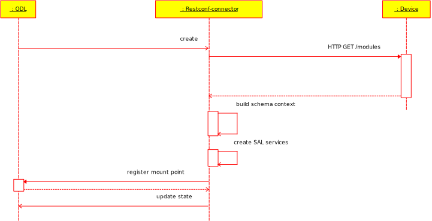

= RESTCONF southbound plugin

== Components

=== Communicator

Low level component. Its purpose is to handle communication between device and mount point component.
It consists of three subcomponents:

Renderer:: translates data from ODL internal format to data suitable for HTTP transfer. It also translates YangInstance
identifier to resource path, which will be appended to url.
Sender:: wrapper for async http client. It takes path and message body from rendered, builds http request and sends it to restconf device.
Parser:: translates data received from device to ODL internal format.

[graphviz, facadeclass, svg]
----
digraph G {
        fontname = "Bitstream Vera Sans"
        fontsize = 8

        node [
                fontname = "Bitstream Vera Sans"
                fontsize = 8
                shape = "record"
        ]

        edge [
                fontname = "Bitstream Vera Sans"
                fontsize = 8
        ]
RestconfFacadeImpl [
label = "{RestconfFacadeImpl|
- renderer : Renderer\l
- parser : Parser\l
- errorParser : ErrorParser\l
- sender : Sender\l
- streamsHandler : RestconfStreamsHandler\l
|
+ getData(LogicalDatastoreType, YangInstanceIdentifier) : ListenableFuture\<Optional\<NormalizedNode\<?, ?\>\>\>\l
+ createXmlRestconfFacade(SchemaContext, Sender, ScheduledThreadPool) : RestconfFacadeImpl\l
+ headData(LogicalDatastoreType, YangInstanceIdentifier) : ListenableFuture\<Void\>\l
+ postOperation(SchemaPath, ContainerNode) : ListenableFuture\<Optional\<NormalizedNode\<?, ?\>\>\>\l
+ postConfig(YangInstanceIdentifier, NormalizedNode\<?, ?\>) : ListenableFuture\<Void\>\l
+ putConfig(YangInstanceIdentifier, NormalizedNode\<?, ?\>) : ListenableFuture\<Void\>\l
+ patchConfig(YangInstanceIdentifier, NormalizedNode\<?, ?\>) : ListenableFuture\<Void\>\l
+ deleteConfig(YangInstanceIdentifier) : ListenableFuture\<Void\>\l
+ registerNotificationListener(RestconfDeviceStreamListener) : void\l
+ subscribeToStream(Stream) : void\l
+ parseErrors(HttpException) : Collection\<RpcError\>\l
+ close() : void\l
}"]
Parser [
label = "{Parser|
|
+ parseNotification(String) : DOMNotification\l
+ parseRpcOutput(SchemaPath, InputStream) : NormalizedNode\<?, ?\>\l
+ parse(YangInstanceIdentifier, InputStream) : NormalizedNode\<?, ?\>\l
}"]
Sender [
label = "{Sender|
|
+ post(Request) : ListenableFuture\<InputStream\>\l
+ patch(Request) : ListenableFuture\<Void\>\l
+ getEndpoint() : String\l
+ get(Request) : ListenableFuture\<InputStream\>\l
+ put(Request) : ListenableFuture\<Void\>\l
+ delete(Request) : ListenableFuture\<Void\>\l
+ head(Request) : ListenableFuture\<Void\>\l
}"]
Renderer [
label = "{Renderer|
|
+ renderGetData(YangInstanceIdentifier, LogicalDatastoreType) : Request\l
+ renderOperation(SchemaPath, ContainerNode) : Request\l
+ renderEditConfig(YangInstanceIdentifier, NormalizedNode\<?, ?\>) : Request\l
+ renderDeleteConfig(YangInstanceIdentifier) : Request\l
}"]

edge [
        arrowhead = "diamond"
]

RestconfFacadeImpl -> Renderer
RestconfFacadeImpl -> Sender
RestconfFacadeImpl -> Parser

}
----

All this components are wrapped in RestconfFacade class for simpler usage. Facade provides operations for RPC and manipulating data on device. Its methods takes ODL types as parameters, uses renderer to convert them to a HTTP request, sender to make the request and parser to convert request back to ODL types.

=== Mount point

Mount point is interface, which ODL applications can use to manipulate data on device. Schema context is needed to register
mount point. It is built from yang sources, which must be present in ODL schema cache folder. Context is built only
from sources listed in GET /restconf/modules reply.

Restconf mount point supports three services:

Data Broker:: creates transactions, which can be used to manipulate data on device.
RPC Service:: allows invocation of procedures supported by device.
Notification Service:: handles notifications received from device.

This services use the Communicator component to control device. For example read transaction uses RestconfFacade method getData() to read data from device.

== Connector initialization flow

When request to create connector is received, communicator is created at first. Then a request is issued to get
a list of supported modules from device. Connector tries to create  a device schema context from sources present
in ODL cache directory according to the listed modules. If all this steps succeeds, device SAL services are created
and mount point is registered. Device state is written to topology operational data store. If initialization fails,
device is marked as failed in operational data store.

RestconfDeviceManager class is an entry point for creating the connector.
[graphviz, restconfdevice, svg]
----
digraph G {
        fontname = "Bitstream Vera Sans"
        fontsize = 8

        node [
                fontname = "Bitstream Vera Sans"
                fontsize = 8
                shape = "record"
        ]

        edge [
                fontname = "Bitstream Vera Sans"
                fontsize = 8
        ]
RestconfDeviceManager [
label = "{RestconfDeviceManager|
- LOG : Logger\l
- deviceId : RestconfDeviceId\l
- node : Node\l
- restconfNode : RestconfNode\l
- processingExecutor : ThreadPool\l
- reconnectExecutor : ScheduledThreadPool\l
- mountpointService : DOMMountPointService\l
- mount : RestconfMount\l
|
+ disconnect() : void\l
+ onDeviceFailed() : void\l
+ connect() : ListenableFuture\<List\<Module\>\>\l
+ close() : void\l
}"]
RestconfMount [
label = "{RestconfMount|
- LOG : Logger\l
- device : RestconfDevice\l
- registration : ObjectRegistration\<DOMMountPoint\>\l
|
+ deregister() : void\l
+ register(DOMMountPointService) : void\l
+ close() : void\l
}"]
RestconfDevice [
label = "{RestconfDevice|
- LOG : Logger\l
- deviceId : RestconfDeviceId\l
- schemaContext : SchemaContext\l
- supportedModules : List\<Module\>\l
- dataBroker : DOMDataBroker\l
- rpcService : RestconfRpcService\l
- notificationService : RestconfNotificationService\l
- restconfFacade : RestconfFacadeImpl\l
|
+ getSupportedModules() : List\<Module\>\l
+ getDeviceId() : RestconfDeviceId\l
+ getSchemaContext() : SchemaContext\l
+ getDataBroker() : DOMDataBroker\l
+ getRpcService() : DOMRpcService\l
+ getNotificationService() : DOMNotificationService\l
+ create(RestconfDeviceId, RestconfNode, ThreadPool, ScheduledThreadPool) : ListenableFuture\<RestconfDevice\>\l
+ close() : void\l
}"]

edge [
        arrowhead = "diamond"
]

RestconfDeviceManager -> RestconfMount
RestconfMount -> RestconfDevice

}

----
